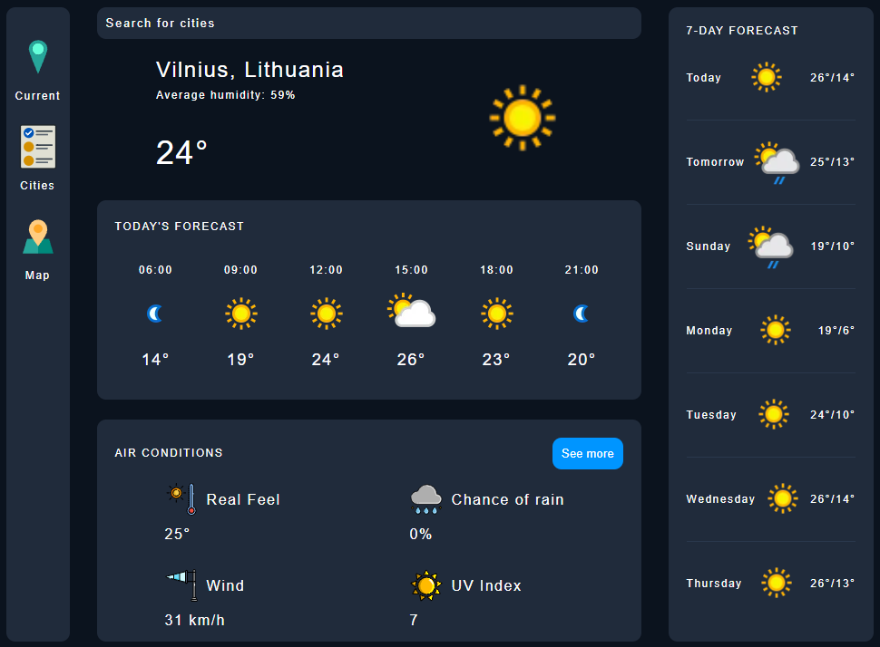
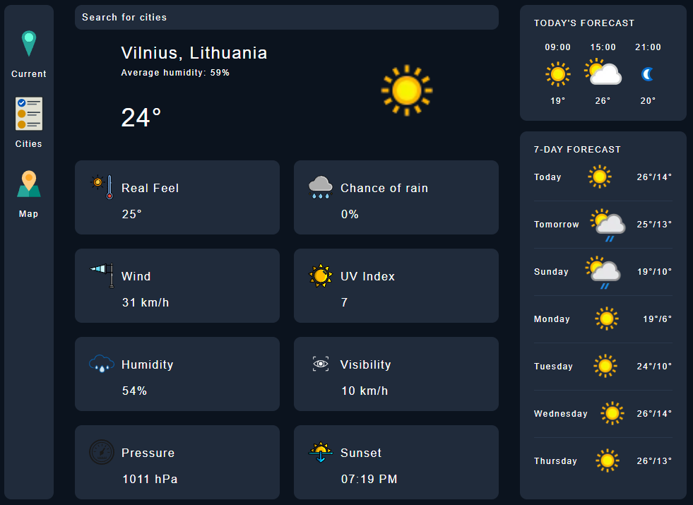
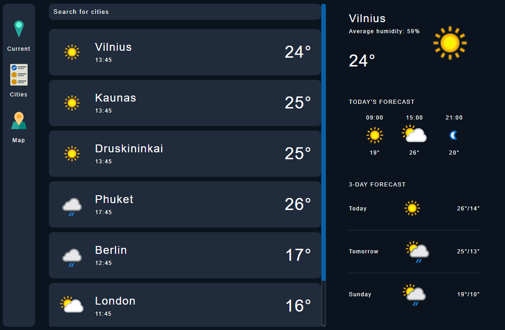
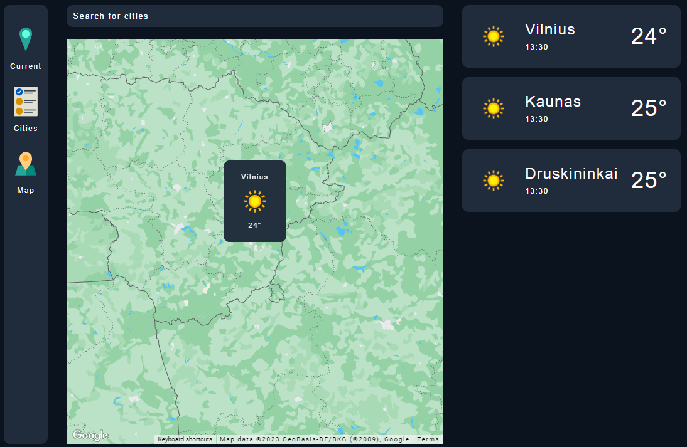

# Weather App

    
    &nbsp;
    
    &nbsp;
    
    &nbsp;
    

## Preview

https://felicitasamanta.github.io/weather-app/index.html

## Overview

The Weather App is a web application that provides real-time weather information for cities around the world. It allows users to:

- View the current weather conditions for their location.
- Search for weather information for specific cities.
- Explore weather forecasts for the next 7 days.
- Visualize weather data on an interactive map.

## Technologies Used

- JavaScript
- Google Maps API
- Geopify API
- Weather API

## Features

- **Current Weather**: Get up-to-date weather details including temperature, humidity, wind speed, and more.

- **Search by City**: Enter the name of a city to quickly access its weather information.

- **7-Day Forecast**: Plan ahead with a 7-day weather forecast, including temperature highs and lows.

- **Interactive Map**: Visualize weather conditions on an interactive map with markers for various cities.

- **User-Friendly**: The app offers an intuitive user interface for a seamless experience.
